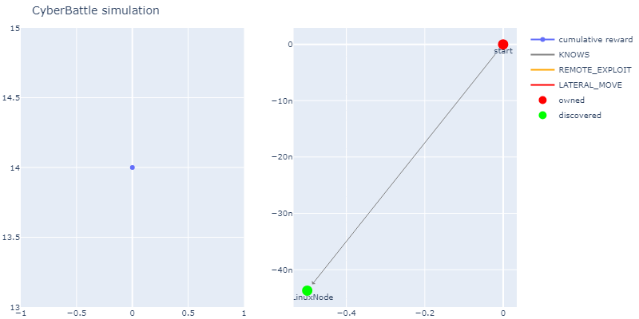

# CyberBattleSim Tutorials

Welcome to the CyberBattleSim Tutorials project! This repository is designed to offer practical, hands-on experience with the CyberBattleSim environment, an open-source platform developed to simulate cybersecurity scenarios and explore the application of reinforcement learning in cybersecurity attack strategies.

These tutorials are structured to guide you through the fundamentals of setting up, interacting with, and extending the CyberBattleSim environment. Whether you're a cybersecurity professional looking to understand how AI can be applied in security contexts, or a machine learning enthusiast curious about cybersecurity applications, these tutorials are crafted to provide valuable insights and skills.

Here is an exemple of a CyberBattleSim training result :



## Getting Started

Before diving into the tutorials, ensure you have the necessary environment set up on your machine. The tutorials are presented in Jupyter notebooks, which allow for an interactive learning experience, combining executable code, rich text, and visualizations.

## Installation

This installation guide is based on a Debian system that is up to date. Start by cloning the CyberBattleSim project:

```bash
git clone https://github.com/microsoft/CyberBattleSim
cd CyberBattleSim
```

### Install Dependencies

Install the necessary system dependencies:

```bash
sudo apt install libnss3-dev libgtk-3-0 libxss1 libasound2-dev libgtk2.0-0 libgconf-2-4
```

### Set Up CyberBattleSim

You can now install CyberBattleSim using the installation script. This script will create a Conda development environment, isolated from your other projects:

```bash
bash init.sh
```

### Activate Environment and Install Jupyter Support

Activate the newly created environment and install `ipykernel` to use JupyterLab for this project:

```bash
conda activate cybersim
conda install ipykernel
python -m ipykernel install --user --name=cyberbattlesim
```

### Add CyberBattleSim to Conda Environment Path

Finally, add the CyberBattleSim directory to your Conda environment paths:

```bash
conda develop .
```

This completes the setup process, and you should now be ready to explore CyberBattleSim tutorials and projects within this isolated Conda environment.

## Tutorials Overview

The tutorials cover a range of topics, from basic to more advanced techniques in applying reinforcement learning to cybersecurity simulations. Here's what you can expect:

1. **Introduction to CyberBattleSim:** [Learn about the CyberBattleSim platform and how it can be used to simulate cybersecurity scenarios](./notebooks/01_tuto.ipynb)
2. **Running a first training:** [Step-by-step instructions to set up and run your first CyberBattleSim training.](./notebooks/02_tuto.ipynb)

Each tutorial is related to an article (for now only in french) here are the articles :
1. [Introduction](https://medium.com/@theodesile/1-application-de-lapprentissage-par-renforcement-en-cybers%C3%A9curit%C3%A9-cd94c843231d)
2. [RL Training](https://medium.com/@theodesile/2-application-de-lapprentissage-par-renforcement-en-cybers%C3%A9curit%C3%A9-7ef44b8d4b20)

## Contributing

We welcome contributions to the CyberBattleSim Tutorials project! If you have suggestions for improvements, additional tutorials, or find any issues, please feel free to open an issue or submit a pull request.

## License

This project is licensed under the MIT License - see the [LICENSE](LICENSE) file for details.

## Acknowledgments

- Thanks to the CyberBattleSim community and contributors for developing and maintaining the simulation environment.

## Additional Resources

For more information on CyberBattleSim, reinforcement learning, and their applications in cybersecurity, please visit the following resources:

- [CyberBattleSim GitHub Repository](https://github.com/microsoft/CyberBattleSim)

---

We hope these tutorials help you gain a deeper understanding of the intersection between artificial intelligence and cybersecurity. Happy learning!